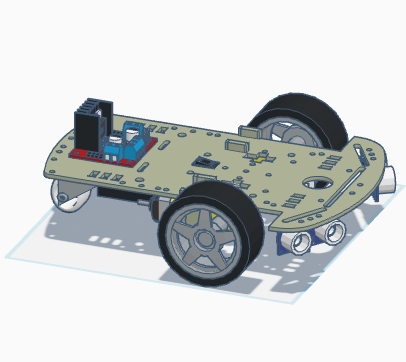

# Obstacle Avoiding Robot with Raspberry Pi Pico

This project showcases a simple robot that can avoid obstacles using two ultrasonic sensors, based on a Raspberry Pi Pico. The robot detects the distance to objects in its path and adjusts its movement to avoid collisions. The project includes the code, circuit diagram, and 3D model created in Tinkercad.

## 3D Model

You can access the 3D model made with Tinkercad [here](https://www.tinkercad.com/things/k87AAEScrFg-obstacle-avoiding-robot-raspberry-pi-pico).
<div>
  
  
  
</div>

## Features

- **Autonomous Movement:** The robot moves forward and avoids obstacles automatically.
- **Obstacle Detection:** It uses two ultrasonic sensors to detect obstacles and measure distances.
- **Decision Making:** Based on the distance readings, the robot decides whether to stop and change direction.

## Components

- Raspberry Pi Pico
- 2x Ultrasonic Sensors HC-SR04
- 2x DC Motors (Left and Right wheels)
- Motor Driver L298N
- Power Supply (Battery)
- Chassis
- Jumper Wires
- Breadboard

## Power to the pico will come from 2 different sources:

```
1. The USB connection (5V)
2. The 5V power output from the motor driver board
```
I decided to use a powerbank for the USB connection.

## Circuit Diagram


## Code

The MicroPython code is in the [main.py](main.py) file

## Demonstration Video

